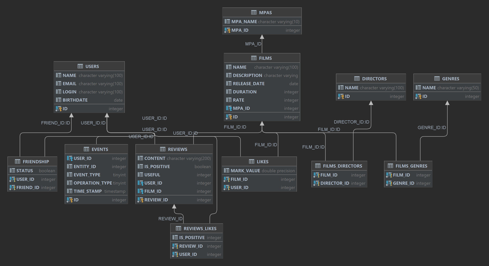
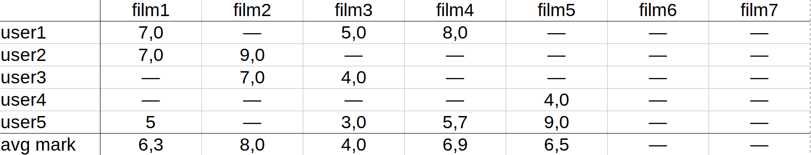
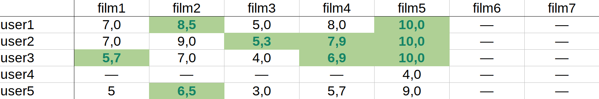
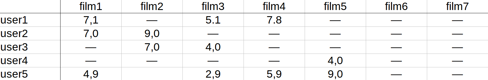

# Filmorate

Приложение рекомендует фильмы для просмотра на основе оценок пользователей.

(Форк в личный репозиторий группового проекта, выполненного в рамках Яндекс.Практикума).

Над проектом работали:
* [Михаил Шпиев](https://github.com/myanotheraccount) — тимлид, 
разработка функциональности удаления фильмов и пользователей, добавление режиссёров к фильмам 
* [Мартик Мартиросян](https://github.com/Moneygenerating) — проджект-менеджер, разработка функциональности отзывов
* [Николай Костин](https://github.com/nikolay-977) — разработка функциональности «общих» фильмов, 
поиска по названию и режиссёру
* [Сергей Назаркин](https://github.com/SergeiNazarkin) — разработка функциональности рекомендаций

* **Денис Михайлов** —
  * вывод самых популярных фильмов по жанру и годам
  * рефакторинг системы лайков в систему оценок
  * разработка алгоритма рекомендаций — прогнозирование оценки фильма пользователем на основе оценок 
других пользователей _(описание реализации ниже)_

---

Технологический стек:
**Spring Boot, H2, JDBC, SQL**

## Доска работы команды

Задания на разработку каждой функциональности с описанием API можно посмотреть на 
[доске разработки проекта в Notion](https://sleepy-holiday-6c2.notion.site/3c24bd27eaa34a158bba5469afba9476?v=53dc042fce504aae8b38af2fe9abcd42)

## Схема базы данных проекта

## Реализация функциональности add-marks

### Эндпойнты

`GET films/{id}/mark/{userId}` — получение оценки, выставленной фильму конкретным пользователем

`GET /films/{id}/mark` — получение средней оценки фильма пользователями

`PUT /films/{id}/mark/{userId}/{mark}` — добавление или изменение оценки фильма пользователем

`DELETE /{id}/mark/{userId}` — удаление оценки фильма пользователем

### Обратная совместимость системы оценок с API по лайкам.

Добавление лайка приводит к выставлению пользовательской оценки 6.0, если оценки ещё не было или она была ниже 5. 
Если оценка уже была положительной, то она увеличивается на 1.
При достижении оценки 10 добавление лайка не меняет оценку.
(Все перечисленные значения заданы в константах модели Mark).

Удаление лайка удаляет оценку.

### Алгоритм рекомендаций

Прогнозируемая оценка вычисляется по алгоритму Slope One.

Для запрашивающего пользователя по каждому фильму вычисляется набор прогностических оценок — по числу пользователей,
которые смотрели фильм (и которые ранее ставили оценки - не важно какие - тем же фильмам, что и запрашивающий).
Предполагается, что запрашивающий поставил бы каждую из прогнозируемых оценок, если исходить из средней дельты между
его оценками и оценками другого пользователя по ранее просмотренным фильмам.
Далее, для каждой из этих оценок взят вес, равный числу принятых в расчёт сопоставлений между оценками двух
пользователей по ранее просмотренным фильмам.
Итоговая прогностическая оценка определяется как средневзвешенная между прогностическими оценками, отсчитанными
от разных пользователей.

Алгоритм реализован в SQL-запросе [films_get_recommendations.sql](src/main/resources/sql/films_get_recommendations.sql).

### Тестирование

Составлены [тесты для оценок](src/test/java/ru/yandex/practicum/filmorate/MarksTest.java).

Также составлены 
[тесты для алгоритма рекомендаций](src/test/java/ru/yandex/practicum/filmorate/RecommendationsTest.java), 
которые сверяют обратный прогноз алгоритма с уже выставленными оценками.

При тестировании использован заранее заданный набор данных 
[marks_data.sql](src/test/resources/marks_data.sql).

Заданные оценки

Прогнозируемые оценки (оценки меньше 5 не приводятся в рекомендациях)

Оценки, вычисленные методом обратного прогноза для сопоставления с исходными

